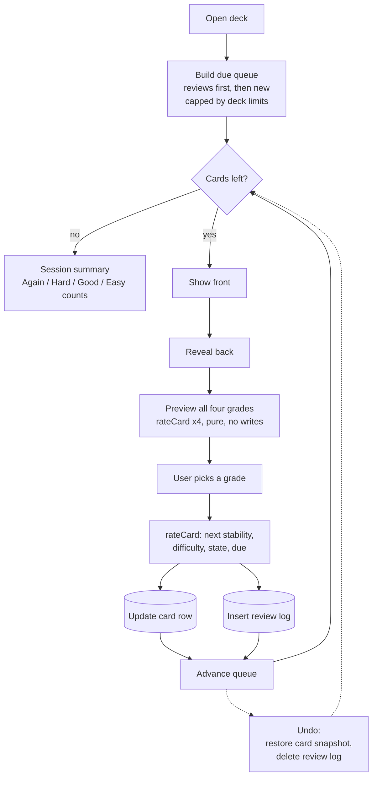
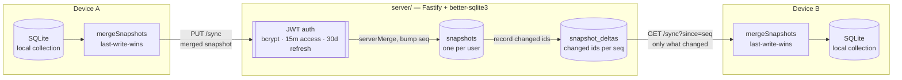

# Kondor — کُندُر

Cross-platform spaced-repetition flashcards. FSRS scheduling over a local-first SQLite database,
with an optional self-hosted sync server that does server-side merge and incremental pulls.

**Status: feature-complete prototype, not actively maintained.** Built 23–25 June 2026 in a
three-day sprint (40 commits, 7 release tags, one author). The study loop, statistics,
import/export, and multi-device sync all work today, and 112 tests cover them. It is not on any
app store: Android ships as a debug-signed sideload APK, and iOS is PWA-only.

[](https://github.com/mojtabanorouzie/kondor/actions/workflows/ci.yml)
[](https://mojtabanorouzie.github.io/kondor/)
[](https://www.typescriptlang.org/)
[](LICENSE)

**Try it without installing anything: <https://mojtabanorouzie.github.io/kondor/>** — the PWA runs
entirely in the browser, offline, with no account and no server.

*Kondor* (Persian **کُندُر**, "frankincense") is the aromatic resin traded along Persian trade
routes. In classical Persian medicine it was prized as a memory strengthener (تقویت حافظه) —
students were said to chew it before study.

---

## Why it exists

Spaced repetition is a solved problem algorithmically, and the algorithm is the part everyone
assumes is hard. I wanted to build a full flashcard app end to end and find out where the real
difficulty actually sits.

It is not the scheduler. FSRS is well specified and has a good library behind it, so the work
there is design, not math: putting a pure, testable boundary around it. The hard part was sync —
making two devices that both edited while offline converge on the same collection without a server
arbitrating every write, and without a deletion on one device being silently resurrected by the
other that never saw it. That problem is what most of `src/services/sync/` and `server/` exist to
solve, and it is the part of this repo worth reading.

## How it works

### Scheduling

Cards are scheduled with **FSRS** (Free Spaced Repetition Scheduler), the algorithm Anki adopted to
replace SM-2. FSRS models each card with two latent variables:

- **stability** — how many days until recall probability decays to the target retention
- **difficulty** — how much a given card resists gaining stability

After each answer it updates both and picks the next interval so the card comes back when your
predicted recall probability has fallen to `requestRetention`, which defaults to `0.9`
(`src/services/srs/params.ts`).

**The FSRS math itself comes from [`ts-fsrs`](https://github.com/open-spaced-repetition/ts-fsrs)
v5 — this repo does not reimplement it.** What is written here is the boundary around it, which is
where the design decisions live:

- **`rateCard` is pure** (`src/services/srs/scheduler.ts`) — it takes a `SchedulingState`, a grade,
  and a timestamp, and returns the next state plus a review-log entry. No I/O, no mutation. That
  purity is what makes the interval previews below possible, and it is why the scheduler is
  testable without a database.
- **`gradeCard` is the persistence shell** (`src/services/srs/review.ts`) — load the card, call the
  pure function, write the card and the log.
- **A narrow `SchedulingState`** carries only the scheduling-relevant columns, so database rows and
  UI models never leak into the algorithm.
- `CardState` and `Grade` (`src/types/index.ts`) are declared with the same numeric values as
  ts-fsrs's `State` and `Rating`, so conversion at the boundary is a value-preserving cast rather
  than a lookup table.

Because `rateCard` is pure, the study screen previews all four outcomes *before* you answer: it
runs the scheduler four times against the current card and labels each button with the interval
that grade would produce ("10m", "4d", "3mo" — `src/features/study/format-interval.ts`).



Undo keeps a snapshot of the card row plus the id of the review log it wrote, so reverting a grade
restores the exact prior scheduling state instead of trying to invert the algorithm.

### Storage, and the same code on web and native

One Drizzle schema and one set of repositories serve every platform. Getting there needed one
non-obvious decision, documented in `src/db/client.ts`:

> We deliberately avoid Drizzle's `expo-sqlite` driver: it uses the synchronous SQLite API, whose
> web (WASM worker) implementation corrupts results under the app's startup query burst.

Instead the app opens expo-sqlite's **async** API and adapts it to Drizzle's `sqlite-proxy` driver.
The same repositories then run unmodified against an in-memory better-sqlite3 database in tests.

### Sync

Sync is offline-first: every device owns a full local collection and can edit while disconnected.
Reconciliation is **last-write-wins on `updatedAt`, with ties broken by id** — which makes the
merge deterministic, commutative, and idempotent, so devices converge no matter what order they
sync in. `decks`, `notes`, and `cards` merge that way; `noteTypes` and `reviewLogs` are append-only
and merge by union.

Deletes are **tombstones**, not row removals (`deletedAt`, migration `0005_tombstones.sql`).
Deleting a deck stamps `deletedAt` *and* bumps `updatedAt`, so the deletion wins the LWW comparison
and propagates. Without this, a peer that never saw the delete would push its stale live copy back
and resurrect it.



Offline, the same engine runs against the localStorage or in-memory backend instead, so neither a
server nor an account is required to use the app.

The client engine (`src/services/sync/engine.ts`) pulls a delta since its last known `seq`, merges
it locally, pushes the merged result, and stores the new `seq`. The server merges again on its side
with the same rules and records which entity ids changed at that `seq`, so a client one change
behind downloads one change rather than the whole collection.

`SyncBackend` is a two-method interface (`pull`, `push`) with three implementations — in-memory
(tests), localStorage (serverless web demo), and REST — so the engine never knows where the
snapshot lives.

See [`docs/adr/`](docs/adr/) for the decision records and [`server/README.md`](server/README.md)
for the server's API and deployment notes.

---

## What works today

| Area | State | Notes |
|---|---|---|
| FSRS scheduling | Works | via `ts-fsrs` v5; retention/interval/fuzz configurable in code |
| Decks, notes, cards | Works | full CRUD; Basic + Cloze note types |
| Study session | Works | reveal → grade, four-way interval preview, undo, per-deck daily limits |
| Statistics | Works | streak, retention, reviews-per-day, due forecast, calendar heatmap |
| CSV/TSV + JSON import | Works | delimiter auto-detect, quoted fields; full JSON backup/restore |
| Anki `.apkg` import | **Web/desktop only** | native ships a stub that throws — see Limitations |
| Self-hosted sync | Works | JWT + OAuth, per-user isolation, tombstones, delta pulls |
| i18n + RTL | Works | English and Persian, with RTL layout |
| Theming | Works | light / dark / system, persisted |
| PWA | Works | installable, offline, service worker, local WASM — no CDN |

## Quickstart

**Prerequisites:** Node 24 (what CI and the release workflow use — no `engines` field is declared,
and older versions are untested). Android Studio or Xcode only if you want a native build.

```bash
git clone https://github.com/mojtabanorouzie/kondor.git
cd kondor
npm install          # npm ci will fail — see the note in .github/workflows/ci.yml

npm run start        # Expo dev server → press a (Android) · i (iOS) · w (Web)
npm run web          # browser only
npm run android      # Android emulator / device
```

### Checks

```bash
npm run typecheck    # tsc --noEmit
npm run lint         # ESLint
npm test             # 70 tests, 10 suites
```

```bash
cd server && npm install
npm run typecheck
npm test             # 42 tests: auth, token rotation, OAuth, isolation, delta sync
```

All five run in CI on every push and pull request.

### Build the PWA

```bash
npm run export:web   # copies sql-wasm.wasm into public/, then expo export --platform web
# serve dist/ from any static host
```

### Run the sync server

```bash
cd server
npm install
cp .env.example .env   # set JWT_SECRET before exposing this anywhere
npm start              # listens on :3000
```

Register an account, then enter the server's **base URL** (no path) under Settings → Sync in the
app. Full notes in [`server/README.md`](server/README.md).

## Downloads

Pushing a `v*` tag runs [`release.yml`](.github/workflows/release.yml), which attaches build
artifacts to the matching [GitHub Release](https://github.com/mojtabanorouzie/kondor/releases):

| Platform | Artifact | Notes |
|---|---|---|
| Android | `Kondor.apk` | **Debug-keystore signed.** Sideload only; enable "install unknown apps" |
| Windows | `Kondor_x64-setup.exe` | The PWA wrapped in Tauri; NSIS installer |
| Web / iOS | [GitHub Pages](https://mojtabanorouzie.github.io/kondor/) | Add to Home Screen; no signing or sideloading |

## Project layout

```
src/
├── app/              # Expo Router screens (file-based routing)
├── components/       # Presentational UI
├── features/         # cards · decks · statistics · study
├── db/               # Drizzle schema, migrations, repositories, async client
├── services/
│   ├── srs/          # FSRS boundary: params, pure scheduler, persistence shell
│   ├── sync/         # engine, LWW merge, backends (memory · local · rest)
│   ├── import-export/# CSV, JSON backup, Anki .apkg (+ native stub)
│   └── templating/   # cloze parsing, card rendering
├── store/            # React Context providers (auth, settings)
├── i18n/             # en · fa
└── types/            # shared domain types
server/               # Fastify sync server — separate package, own lockfile
docs/                 # ROADMAP, ARCHITECTURE, ADRs
__tests__/            # 10 app suites
```

## Limitations

Known and deliberate, so you don't have to find them by reading the source:

- **Anki `.apkg` import does not work on Android or iOS.** `sql.js` bundles a `require('node:fs')`
  that Metro cannot resolve for a React Native target, which broke the release bundle, so native
  builds ship `apkg.native.ts` — a stub that throws. Web and the Tauri desktop build are fine.
- **Anki import drops scheduling history.** Notes and fields come across; imported cards start as
  New. Review logs and intervals are not read from the collection.
- **The Android APK is signed with the default debug keystore.** Fine for sideloading, not
  publishable to Play. There is no release-signing pipeline.
- **No iOS build.** The unsigned iOS pipeline was dropped; iOS is reachable only via the PWA.
- **OAuth is unconfigured out of the box.** Google and GitHub sign-in need
  `EXPO_PUBLIC_*_CLIENT_ID` on the client and matching secrets on the server; the buttons hide
  themselves when unset.
- **`POST /auth/forgot-password` is a stub.** It always returns 204 and sends no email.
- **Grading is not transactional.** `gradeCard` writes the card and the review log as two
  statements; a crash between them could drop a log. Noted in the source at
  `src/services/srs/review.ts`.
- **Lapsed cards are not re-shown within the same session.** They get the correct schedule, but
  Anki would surface them again before you finish.
- **The app icon is still Expo's logo** (`assets/expo.icon/`, `assets/images/icon.png`).
- **FSRS parameters are not user-tunable.** `DEFAULT_SRS_CONFIG` is a code constant, and there is
  no optimizer that fits parameters to your own review history.
- Single author, no external users, and no commits since June 2026.

## Roadmap

[`docs/ROADMAP.md`](docs/ROADMAP.md) tracks phases 0–16: tombstones (11), the sync server (12),
multi-user auth (13), delta sync (14), platform polish (15), and ESLint/Prettier (16) are all
done. One box is still open in phase 15 — verifying that expo-sqlite's OPFS storage survives a
web PWA reload. Beyond that, remaining work is the app-store path (needs paid developer accounts
and real signing keys) and the limitations above.

## Contributing

[`CONTRIBUTING.md`](CONTRIBUTING.md) has the details. In short: branch as `feat/<name>` or
`fix/<name>`, and make sure `npm run typecheck`, `npm run lint`, and `npm test` pass in both the
root package and `server/`.

## License

MIT — see [LICENSE](LICENSE).
